\# Cryptography Basics


\## What it is

Cryptography turns readable data into unreadable data (and back) in ways

that protect \*\*confidentiality, integrity, and authenticity\*\*. As an

engineer, you almost never implement crypto — you \*use\* it correctly. The

job is knowing which tool for which problem, and what "correctly" means.


\*\*Rule zero: never roll your own crypto.\*\* Use vetted libraries. This note

is about knowing what those libraries are doing.


\## The mental model

```mermaid

flowchart TB

&#x20;   Crypto\[Cryptography]

&#x20;   Crypto --> Sym\[Symmetric<br/>Same key both sides]

&#x20;   Crypto --> Asym\[Asymmetric<br/>Public + Private key]

&#x20;   Crypto --> Hash\[Hashing<br/>One-way, no key]

&#x20;   Sym --> SymUse\[Fast bulk encryption<br/>AES-256-GCM, ChaCha20]

&#x20;   Asym --> AsymUse\[Key exchange, signatures<br/>RSA, ECDSA, Ed25519]

&#x20;   Hash --> HashUse\[Integrity, passwords<br/>SHA-256, bcrypt, argon2]

```


\## Symmetric encryption

One shared key encrypts and decrypts. Fast, used for bulk data.


\- \*\*Modern algorithms:\*\* AES-256-GCM, ChaCha20-Poly1305.

\- \*\*What GCM/Poly1305 give you:\*\* \*\*AEAD\*\* — Authenticated Encryption with Associated Data. Confidentiality \*and\* integrity in one primitive. Use these; never plain AES-CBC without a MAC.

\- \*\*Problem:\*\* how do two parties share the key in the first place? → asymmetric solves this.


\## Asymmetric (public-key) encryption

Two mathematically linked keys: public (share freely) and private (guard).

\- Encrypt with the recipient's \*\*public\*\* key → only their \*\*private\*\* key decrypts. (Confidentiality)

\- Sign with your \*\*private\*\* key → anyone with your \*\*public\*\* key verifies. (Authenticity + integrity)


\*\*Algorithms:\*\*

\- \*\*RSA\*\* — still common, but slow and needs 2048-bit+ keys for safety.

\- \*\*ECC (Elliptic Curve)\*\* — smaller keys, faster. \*\*Ed25519\*\* for signing, \*\*X25519\*\* for key exchange, \*\*ECDSA\*\* for legacy signing.

\- \*\*Post-quantum:\*\* ML-KEM (Kyber), ML-DSA (Dilithium) — being rolled out because quantum computers will eventually break RSA/ECC.


Asymmetric is slow, so real systems use it to exchange a \*\*symmetric session

key\*\* — then encrypt the actual data symmetrically. This is what TLS does.


\## Hashing

One-way function: input → fixed-size digest. You can't reverse it.


\- \*\*General-purpose:\*\* SHA-256, SHA-3, BLAKE3. Fast; used for integrity, checksums, HMACs.

\- \*\*Password hashing:\*\* must be \*\*slow and memory-hard\*\* to resist brute force. Use \*\*argon2id\*\* (best), \*\*bcrypt\*\* (fine), or \*\*scrypt\*\*. \*\*Never\*\* SHA-256 or MD5 for passwords.

\- \*\*Broken:\*\* MD5 and SHA-1 — collisions found. Use them only for non-security checksums.


Passwords also need a \*\*salt\*\* (random per-user value) to prevent rainbow-table attacks. Modern password hashers add salt for you.


\## Digital signatures

Prove \*this exact message\* came from the holder of \*this private key\* and wasn't altered.

```mermaid

sequenceDiagram

&#x20;   Alice->>Alice: hash(msg) → digest

&#x20;   Alice->>Alice: sign(digest, private\_key) → signature

&#x20;   Alice->>Bob: msg + signature

&#x20;   Bob->>Bob: hash(msg) → digest

&#x20;   Bob->>Bob: verify(digest, signature, public\_key) → true/false

```





Uses: software updates (verify authenticity), Git commit signing, TLS certificates, JWTs, container image signing (Sigstore/cosign).


\## TLS in one paragraph

Client and server do a handshake: agree on ciphers, server proves identity with an X.509 certificate signed by a trusted CA, they use \*\*ECDHE key exchange\*\* to derive a fresh symmetric session key (giving \*\*forward secrecy\*\*), then encrypt everything symmetrically with AES-GCM or ChaCha20-Poly1305. \*\*Always TLS 1.2+ (prefer 1.3).\*\* Disable SSL, TLS 1.0, TLS 1.1.


\## Key concepts worth naming

\- \*\*Kerckhoffs's principle\*\* — a cryptosystem should be secure even if everything about it is public \*except the key\*. If your security relies on the algorithm being secret, it isn't secure.

\- \*\*Forward secrecy\*\* — compromising a long-term key doesn't decrypt past traffic. Achieved via ephemeral key exchange (ECDHE).

\- \*\*Nonce / IV\*\* — a "number used once" that makes the same plaintext encrypt to different ciphertexts each time. \*\*Never reuse a nonce with the same key\*\* (catastrophic for GCM).

\- \*\*HMAC\*\* — hash-based message authentication code. `HMAC(key, message)` gives a keyed integrity tag. Use for API request signing, cookie integrity.

\- \*\*Key derivation function (KDF)\*\* — turn a password or master secret into strong cryptographic keys. HKDF, PBKDF2, argon2.

\- \*\*Entropy\*\* — randomness. Use `/dev/urandom` or your language's `secrets` module. \*\*Never\*\* `random.random()` for anything security-related.


\## Where crypto lives in real systems

\- \*\*HTTPS / TLS\*\* — you already use this

\- \*\*SSH\*\* — asymmetric for auth (your Ed25519 key), symmetric for the session

\- \*\*JWT\*\* — signed tokens (HS256 = HMAC, RS256/ES256 = asymmetric signatures)

\- \*\*Password storage\*\* — argon2id / bcrypt

\- \*\*Full-disk encryption\*\* — LUKS, BitLocker, FileVault (AES-XTS)

\- \*\*Signal / iMessage\*\* — end-to-end encryption via Double Ratchet

\- \*\*Software supply chain\*\* — Sigstore, cosign, GPG-signed commits

\- \*\*Blockchain\*\* — hash chains + digital signatures + Merkle trees


\## Common gotchas

\- \*\*MD5/SHA-1 for anything security-sensitive.\*\* Broken. Use SHA-256+.

\- \*\*SHA-256 for passwords.\*\* Way too fast. Use argon2id/bcrypt.

\- \*\*AES-ECB.\*\* Reveals patterns in plaintext (the famous penguin image). Never use ECB.

\- \*\*CBC without a MAC (encrypt-then-MAC).\*\* Padding oracle attacks. Use AEAD (GCM/Poly1305) instead.

\- \*\*Reusing a nonce with GCM.\*\* Catastrophic — leaks the auth key. Generate fresh nonces.

\- \*\*`math.random` / `random.random()` for tokens.\*\* Predictable. Use `secrets` module / `crypto.randomBytes`.

\- \*\*Hardcoded keys in source code.\*\* Grep-able. Use secret managers.

\- \*\*Base64 is not encryption.\*\* It's encoding. Everyone can decode it.

\- \*\*Custom crypto.\*\* You will get it wrong. Trained cryptographers get it wrong. Use libraries.

\- \*\*"Military-grade encryption" in marketing.\*\* Meaningless phrase. Look for the specific algorithm and mode.


\## What I want to try

\- Generate an Ed25519 SSH key pair and understand every field:

&#x20; `ssh-keygen -t ed25519 -C "hale@example.com"`

\- Inspect a real TLS handshake with Wireshark on `curl https://example.com`.

\- Hash a password with `argon2` CLI and compare to `sha256sum` — feel the speed difference.

\- Sign my Git commits with GPG or SSH so commits show a "Verified" badge on GitHub.

\- Read a public breach report where the root cause was a crypto mistake (Adobe 2013 password dump is a classic).


\## Sources

\- \[Cryptographic Right Answers](https://gist.github.com/tqbf/be58d2d39690c3b366ad) — "just tell me what to use"

\- "Serious Cryptography" — Jean-Philippe Aumasson

\- \[Cryptopals crypto challenges](https://cryptopals.com/) — hands-on, break real crypto

\- OWASP Cryptographic Storage Cheat Sheet


