\# SQL Injection


\## What it is

\*\*SQL Injection (SQLi)\*\* happens when user input is concatenated into a

SQL query as \*code\*, not treated as \*data\*. The attacker sends input that

breaks out of the intended data context and adds their own SQL — reading

data they shouldn't, modifying it, or in the worst case taking over the

database server.


It's one of the oldest web vulnerabilities (\~1998) and \*still\* on the OWASP

Top 10 (under \*\*A03: Injection\*\*). The fix is well-known and easy. The bug

keeps showing up because developers keep concatenating strings.


\## The mental model

```mermaid

flowchart LR

&#x20;   Input\[User input] --> App\[App code]

&#x20;   App -->|BAD: string concat| Query1\[Query = code + input mixed]

&#x20;   App -->|GOOD: parameterized| Query2\[Query = fixed code<br/>+ separate data]

&#x20;   Query1 --> DB1\[(DB executes attacker's SQL)]

&#x20;   Query2 --> DB2\[(DB executes safe query)]

```


The whole vulnerability is one confusion: \*\*is the input code or data?\*\*

Parameterized queries answer that once and for all — data stays data.


\## The classic example


\*\*Vulnerable PHP-ish pseudocode:\*\*

```

username = request.get("username")

password = request.get("password")


query = "SELECT \* FROM users WHERE username = '" + username +

&#x20;       "' AND password = '" + password + "'"

```


Normal login: `username=alice`, `password=hunter2` →

```sql

SELECT \* FROM users WHERE username = 'alice' AND password = 'hunter2'

```


Attack: `username=admin' --`, `password=anything` →

```sql

SELECT \* FROM users WHERE username = 'admin' -- ' AND password = 'anything'

```

The `--` is a SQL comment. Everything after it is ignored. The query returns

the admin row without ever checking the password. \*\*Login bypassed.\*\*


\## The types of SQLi


\### 1. In-band (classic)

Results come back in the same HTTP response.

\- \*\*Error-based\*\* — trigger a DB error that leaks data (`AND 1=CONVERT(int,(SELECT @@version))`).

\- \*\*UNION-based\*\* — append a `UNION SELECT` to pull data from other tables (`' UNION SELECT username, password FROM users --`).


\### 2. Blind

No error messages, no visible query output — but the app behaves differently based on the query result.

\- \*\*Boolean-based\*\* — `AND 1=1` (page loads normally) vs `AND 1=2` (different response). One bit at a time.

\- \*\*Time-based\*\* — `AND SLEEP(5)` if condition true. Extract data by measuring response time. Slow but reliable.


\### 3. Out-of-band

Data is exfiltrated via a separate channel — usually the database making a DNS or HTTP request to attacker-controlled infrastructure. Used when in-band and blind both fail.


\### Second-order

The malicious input is stored (e.g. during registration), then executed \*later\* when a different query uses it. Sanitizing only on input misses this.


\## What an attacker actually does

```mermaid

sequenceDiagram

&#x20;   Attacker->>App: Test input with '

&#x20;   App->>Attacker: Error / behavior change

&#x20;   Attacker->>Attacker: Confirm injectable

&#x20;   Attacker->>App: Determine columns (ORDER BY)

&#x20;   Attacker->>App: Enumerate tables (information\_schema)

&#x20;   Attacker->>App: Dump data (UNION SELECT)

&#x20;   Attacker->>App: Escalate (INTO OUTFILE, xp\_cmdshell...)

```




Modern reality: nobody does this by hand for long. \*\*sqlmap\*\* automates all of it. But you need to understand what it's doing to interpret its output — and to write detections that catch it.


\## Beyond stealing data

Depending on DB engine + permissions, SQLi can lead to:

\- \*\*File read/write\*\* — `LOAD\_FILE()`, `INTO OUTFILE` (MySQL).

\- \*\*RCE (remote code execution)\*\* — `xp\_cmdshell` (MSSQL if enabled), UDFs (MySQL), `pg\_exec` (Postgres extensions).

\- \*\*Lateral movement\*\* — pivot from the DB into internal networks.

\- \*\*Full server compromise.\*\*


This is why "just SQLi" can mean "full breach." Equifax (2017), Heartland (2008), TalkTalk (2015), 7-Eleven — all SQLi or SQLi-adjacent.


\## The fix — three layers


\### 1. Parameterized queries (prepared statements) — the real fix

The query and the data are sent to the database \*\*separately\*\*. The DB never mixes them.


\*\*Python (psycopg2):\*\*

```python

cur.execute(

&#x20;   "SELECT \* FROM users WHERE username = %s AND password = %s",

&#x20;   (username, password)

)

```


\*\*Node.js (pg):\*\*

```javascript

await client.query(

&#x20;   "SELECT \* FROM users WHERE username = $1 AND password = $2",

&#x20;   \[username, password]

);

```


\*\*Java (JDBC):\*\*

```java

PreparedStatement s = conn.prepareStatement(

&#x20;   "SELECT \* FROM users WHERE username = ? AND password = ?");

s.setString(1, username);

s.setString(2, password);

```


The `?` / `%s` / `$1` is a \*\*placeholder\*\*, not string interpolation. This is the entire fix.


\### 2. ORMs — usually safe (but not automatically)

Django's ORM, SQLAlchemy, Prisma, Hibernate use parameterized queries under

the hood. But \*\*raw query methods\*\* (`raw()`, `.query()`, `text()`) bypass

the protection. Grep your codebase for these.


\### 3. Defense in depth

\- \*\*Least-privileged DB user\*\* — the app account shouldn't be able to `DROP TABLE` or read `information\_schema`.

\- \*\*Input validation\*\* — allowlist expected format (email, integer). Doesn't replace parameterization; complements it.

\- \*\*WAF\*\* — catches known patterns (`' OR 1=1--`). Attackers routinely bypass WAFs, so this is a speed bump, not a solution.

\- \*\*Error handling\*\* — never show raw DB errors to users. Log them, show a generic page.


\### What does NOT fix it

\- \*\*Escaping quotes yourself.\*\* Every engine has edge cases. You'll miss one.

\- \*\*Blocking keywords like `UNION` or `SELECT`.\*\* Comment tricks, encoding, case, whitespace variants defeat this. Bad idea.

\- \*\*Client-side validation.\*\* Attacker skips the browser. Irrelevant.

\- \*\*`mysql\_real\_escape\_string` on its own.\*\* Insufficient — charset and context issues. Use parameters.


\## Detection \& monitoring

\- \*\*WAF logs\*\* — blocked SQLi attempts (ModSecurity CRS, AWS WAF managed rules).

\- \*\*DB audit logs\*\* — unusual queries, `information\_schema` reads, `UNION SELECT` from the app user, sudden spike in errors.

\- \*\*App logs\*\* — 500s from the DB layer, malformed queries, single-quotes appearing in fields that shouldn't have them.

\- \*\*Time-based blind\*\* — spike in slow queries from one endpoint.


Sigma rules for common SQLi patterns exist in SigmaHQ — worth grepping for `sql\_injection`.


\## Common gotchas

\- \*\*"We use an ORM, so we're safe."\*\* Until someone uses `.raw()` for that one tricky report.

\- \*\*Stored procedures aren't automatically safe\*\* — they can concatenate too. Same rule: parameters, not concatenation.

\- \*\*NoSQL injection is a thing.\*\* MongoDB, Elasticsearch, etc. Different syntax, same root cause. Query builders help.

\- \*\*ORM `LIKE` queries.\*\* User-supplied `%` and `\_` can cause performance issues and unexpected matches. Escape them at the app layer.

\- \*\*Second-order SQLi.\*\* Data stored safely can be unsafely used later. Parameterize \*every\* query, not just the ones near input.

\- \*\*Blind ≠ hard.\*\* With sqlmap and time-based extraction, a blind SQLi is basically as exploitable as a visible one, just slower.

\- \*\*Errors help attackers.\*\* Verbose errors in production = free reconnaissance.


\## What I want to try

\- Deploy \*\*DVWA\*\* or \*\*OWASP Juice Shop\*\* in Docker and manually exploit each SQLi level.

\- Run \*\*sqlmap\*\* against DVWA (`sqlmap -u "http://localhost/vuln.php?id=1" --dbs`) and watch what it does.

\- Take vulnerable code and refactor it to parameterized queries — commit both versions in a "before/after" repo.

\- Set up a small Flask/Express app with an intentional SQLi bug, then write a \*\*Semgrep\*\* or \*\*CodeQL\*\* rule that flags it.

\- Read a public post-mortem where SQLi was root cause (TalkTalk 2015 is well-documented).


\## Sources

\- \[OWASP SQL Injection page](https://owasp.org/www-community/attacks/SQL\_Injection)

\- \[OWASP Prevention Cheat Sheet](https://cheatsheetseries.owasp.org/cheatsheets/SQL\_Injection\_Prevention\_Cheat\_Sheet.html)

\- \[PortSwigger Web Security Academy — SQL Injection](https://portswigger.net/web-security/sql-injection) (free, hands-on)

\- \[sqlmap docs](https://github.com/sqlmapproject/sqlmap/wiki)

\- "The Web Application Hacker's Handbook" — Stuttard \& Pinto

